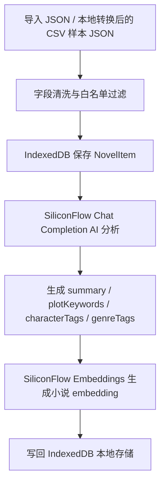
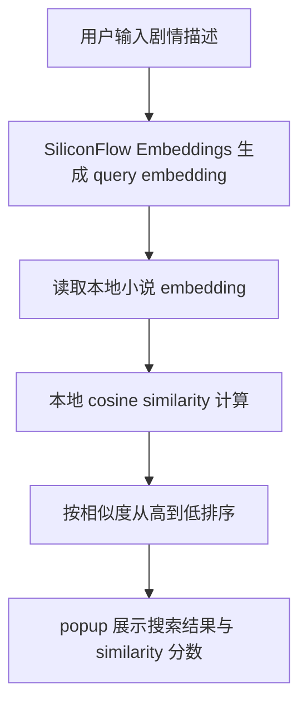

# Novel Recall

Novel Recall 是一个本地优先的小说记忆与检索 Chrome 扩展。它面向“我记得剧情但忘了书名”的场景，支持导入本地小说元数据、AI 提取剧情标签、生成向量，并用自然语言剧情描述做本地语义检索。

项目保持明确边界：不做平台适配，不写爬虫，不采集网页正文或章节正文，不保存完整小说正文。

## 项目截图占位

可在最终展示时补充以下截图：

- popup 剧情检索界面
- options 设置与数据管理界面
- demo 数据导入后的小说列表
- 剧情语义检索结果
- AI 猜书候选结果

## 核心功能

- 本地小说库：JSON 导入、IndexedDB 存储、列表展示、删除、清空确认、JSON 导出。
- 关键词检索：按标题、作者、分类、简介、标签、AI 摘要和 AI 标签做本地匹配。
- AI 分析：调用 SiliconFlow Chat Completion，为单条或批量小说生成 `summary`、`plotKeywords`、`characterTags`、`genreTags`。
- 向量生成：调用 SiliconFlow Embeddings，为小说元数据和 AI 标签生成 `embedding`。
- 剧情语义检索：为用户输入的剧情描述生成 query embedding，在本地用 cosine similarity 排序。
- AI 猜书助手：当本地库没有满意结果时，基于用户描述生成可能候选，并明确标注“AI 推测，未验证”。
- 安全 demo：提供手写虚构的 `examples/demo-novels.json`，可用于公开演示。

## 技术栈

- React 18
- Vite
- Chrome Extension Manifest V3
- IndexedDB
- `chrome.storage.local`
- SiliconFlow Chat Completion
- SiliconFlow Embeddings
- 本地 cosine similarity

## 使用流程

1. 执行构建并在 Chrome 加载 `dist/`。
2. 打开 options 页面，导入 `examples/demo-novels.json` 或用户自己的小说元数据 JSON。
3. 在 options 页面配置 SiliconFlow API Key。
4. 批量执行 AI 分析，生成摘要和剧情标签。
5. 批量生成小说向量。
6. 在 popup 中使用剧情检索或关键词检索。
7. 如果本地库没有满意结果，可切换到 AI 猜书模式获取未验证候选。
8. 如需备份，在 options 页面导出 JSON。

## 架构说明

Novel Recall 拆成两个界面：

- popup：日常搜索入口，只保留剧情检索、关键词检索、AI 猜书和结果列表。
- options：管理后台，提供 API Key 设置、导入导出、清空确认、AI 批处理、向量批处理和单条管理。

关键模块：

```text
src/
  NovelManager.jsx        popup / options 共用的主界面逻辑
  novel-manager.css       界面样式
  ai/
    siliconflow.js        Chat Completion 与 Embeddings 调用
  storage/
    novels.js             IndexedDB 小说数据读写
    settings.js           chrome.storage.local API Key 存储
  utils/
    vector.js             cosine similarity
  popup/
    main.jsx              popup 入口
  options/
    main.jsx              options 入口
```

当前 manifest 只包含 `storage` 权限和 `https://api.siliconflow.cn/*` 这一项 host permission，没有 background、content script、tabs、history、cookies 或 webRequest 权限。

## Mermaid 流程图

数据处理流程：



剧情检索流程：



## 本地运行

安装依赖：

```powershell
cd D:\code\NovelRecall
npm install
```

开发模式：

```powershell
npm run dev
```

生产构建：

```powershell
npm run build
```

构建产物输出到：

```text
D:\code\NovelRecall\dist
```

`dist/` 不提交到 Git。

## 插件加载

1. 打开 `chrome://extensions`。
2. 开启“开发者模式”。
3. 点击“加载已解压的扩展程序”。
4. 选择 `D:\code\NovelRecall\dist`。
5. 点击工具栏中的 Novel Recall 图标打开 popup。
6. 在扩展详情或 popup 右上角设置按钮进入 options 页面。

每次重新执行 `npm run build` 后，需要在 `chrome://extensions` 中刷新扩展。

## Demo 数据

公开 demo 数据位于：

```text
examples/demo-novels.json
```

这份数据包含 12 条手写虚构小说简介，覆盖校园重生、古言权谋、末世囤货、玄幻升级、娱乐圈甜宠、悬疑破案、无限流、修仙成长、先婚后爱、穿书反派洗白、星际机甲、种田经营等题材。

它不来自真实小说平台，不来自 Hugging Face 或 Chinese-web-novel 抽样数据，不包含完整小说正文，可用于 GitHub README、录屏和面试演示。

## 搜索评估

搜索评估说明位于：

```text
docs/search-evaluation.md
```

建议使用 `examples/demo-novels.json` 做可复现评估，对比：

- 关键词检索
- 本地剧情语义检索
- AI 猜书候选

评估时记录 expected title 是否进入 Top 5、语义检索排名、AI 猜书是否返回候选或追问。

## AI 猜书说明

AI 猜书是开放式候选生成，不是数据库检索，也不是联网搜索。它只调用 SiliconFlow Chat Completion，不调用 embedding，不读取本地小说库，不写入 IndexedDB，不导出 JSON。

当用户描述太短、无意义或过于泛化时，AI 猜书会返回 `need_more_info` 并追问更多细节，而不是强行生成“未知小说1”“可能的书名”等占位候选。

候选结果必须由用户自行核验。界面会醒目标注：

```text
AI 推测，未验证
```

本地剧情语义检索和 AI 猜书的区别：

- 本地剧情语义检索：基于用户已经导入 Novel Recall 的本地数据，使用 query embedding 与小说 embedding 做相似度排序。
- AI 猜书：基于大模型对剧情描述的推测生成候选，不代表候选真实存在或已经验证。

## 使用公开数据集进行本地测试

仓库不包含原始公开数据集，也不包含生成后的小说样本 JSON。`data/`、`hf-cache/`、CSV、JSONL、Parquet、Arrow、SQLite 等数据文件已加入 `.gitignore`。

本地转换脚本位于：

```text
scripts/prepare-hf-novel-sample.mjs
```

脚本只读取用户手动准备的本地文件，不下载数据集，不联网，不访问任何小说平台页面。

支持输入格式：

- `.json`
- `.jsonl`
- `.csv`

运行示例：

```powershell
node scripts/prepare-hf-novel-sample.mjs --input data/raw.jsonl --output data/novels-sample.json --limit 100
```

```powershell
node scripts/prepare-hf-novel-sample.mjs --input D:\datasets\Chinese-web-novel\sample.csv --output D:\datasets\Chinese-web-novel\novels-sample.json --limit 100
```

```powershell
node scripts/prepare-hf-novel-sample.mjs --input D:\datasets\Chinese-web-novel\data.csv --output D:\datasets\Chinese-web-novel\novels-sample-50.json --limit 50
```

CSV 使用流式读取，支持引号内逗号和引号内换行，达到 `--limit` 条成功转换记录后停止继续读取。转换时只生成简介摘要，不导出完整正文。

请不要把 `sample.csv`、`data.csv`、转换生成的 JSON、大体积数据文件或真实小说正文提交到 Git。

## 隐私与合规

- 小说数据保存在当前浏览器本地 IndexedDB。
- SiliconFlow API Key 保存在 `chrome.storage.local`，不写入 IndexedDB，不导出 JSON。
- 导出 JSON 只包含 NovelItem 字段，不包含 API Key。
- AI 分析会把用户导入的标题、作者、分类、标签和简介发送给 SiliconFlow Chat Completion。
- 向量生成会把小说元数据、简介、AI 摘要和 AI 标签发送给 SiliconFlow Embeddings。
- 剧情语义检索会把用户输入的剧情 query 发送给 SiliconFlow Embeddings。
- AI 猜书会把用户输入的剧情描述发送给 SiliconFlow Chat Completion。
- 除 SiliconFlow Chat Completion 和 Embeddings 外，不向其他服务发送数据。
- 不采集晋江、番茄、起点或其他平台页面。
- 不采集网页正文、小说章节正文、免费章节正文、VIP 或付费章节正文。
- 不绕过验证码、反爬、字体加密、JS 加密、复制限制或任何平台限制。
- 不调用 App 私有接口。
- 不保存、展示或导出完整小说正文。

## 当前限制

- 语义检索效果依赖用户导入数据的简介质量和 AI 标签质量。
- embedding 会增加导出 JSON 体积。
- AI 猜书候选可能出现幻觉，需要用户自行核验。
- 当前没有云端同步、多人协作或跨设备同步。
- 当前没有平台页面适配，也不会自动采集网页内容。

## Roadmap

- 优化搜索评估指标和 demo 录屏材料。
- 增加更细粒度的本地筛选与排序，例如题材、状态、字数。
- 增加用户确认后的候选保存流程。
- 增加可选的本地备份与恢复提示。
- 完善错误状态、空状态和离线提示。

## 简历亮点

- 从 0 到 1 完成 Chrome 扩展的信息管理、AI 分析与语义检索闭环。
- 使用 IndexedDB 实现本地优先的数据持久化，避免引入后端复杂度。
- 接入 Chat Completion 与 Embeddings，并在本地用 cosine similarity 完成可解释的语义排序。
- 将 popup 搜索入口与 options 管理后台拆分，提升浏览器插件小窗口的可用性。
- 明确隐私与合规边界，避免爬虫、平台采集、正文保存和 API Key 泄漏。
